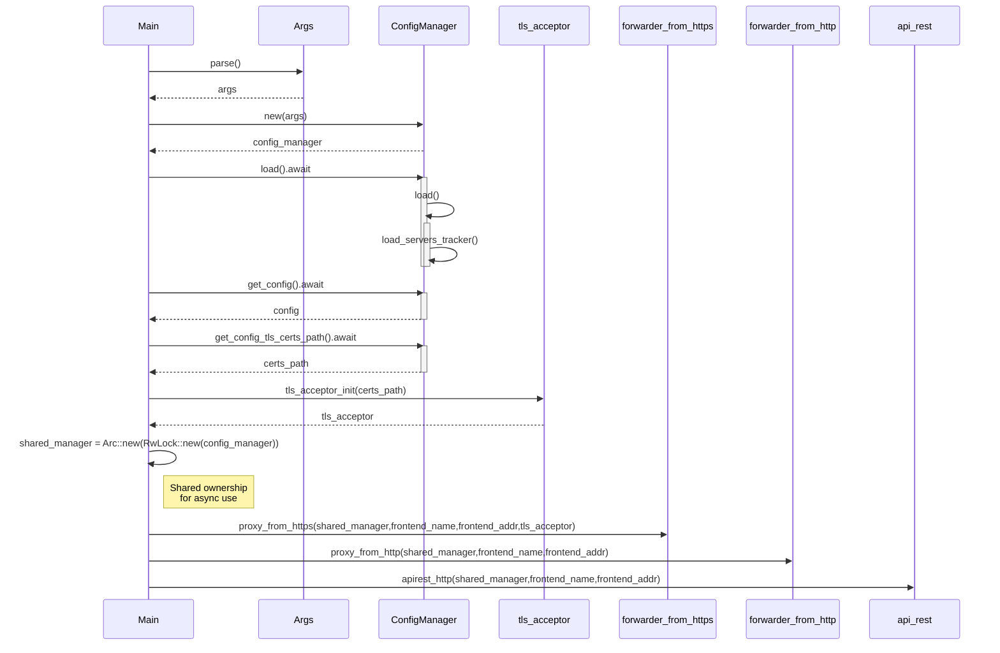

# ConfigManager

ConfigManager is a centralized configuration loader and provider that:

- Loads settings (YAML).

- Safely exposes them to the rest of the app.

- Enables tls_acceptor setup.

- Designed for async/thread-safe usage.

## sequenceDiagram

